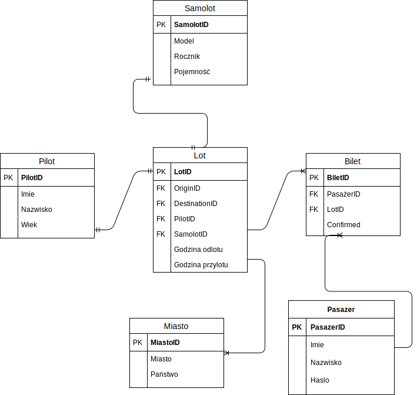

# Temat projektu
Tematem projektu było lotnisko

|  Nazwisko i imię  | Wydział | Kierunek | Semestr | Grupa | Rok akademicki |
| :--------------:  | :-----: | :------: | :-----: | :---: | :------------: |
| Mikołaj Powrózek  | WIMiIP  | IS       |   4     | 3     | 2019/2020      |
| Michał Pastuszko  | WIMiIP  | IS       |   4     | 3     | 2019/2020      |

## Projekt bazy danych

Baza danych składa się z 6 tabel:
- Pasażer,
- Bliet,
- Lot,
- Samolot,
- Pilot,
- Miasto,

## Schemat bazy danych


## Przykładowe zapytania grupy DDL

Utworzenie tabeli bilet: 

```sql
CREATE TABLE IF NOT EXISTS `bilet` (
  `biletID` int(11) NOT NULL AUTO_INCREMENT,
  `pasazerID` int(11) NOT NULL,
  `lotID` int(11) NOT NULL,
  `confirmed` tinyint(1) DEFAULT 0,
  PRIMARY KEY (`biletID`),
  KEY `pasazerID` (`pasazerID`) USING BTREE,
  KEY `lotID` (`lotID`) USING BTREE
);
```

Utworzenie tabeli lot: 

```sql
CREATE TABLE IF NOT EXISTS `lot` (
  `lotID` int(11) NOT NULL AUTO_INCREMENT,
  `originID` int(11) NOT NULL,
  `destinationID` int(11) NOT NULL,
  `pilotID` int(11) NOT NULL,
  `samolotID` int(11) NOT NULL,
  `dephour` varchar(255) NOT NULL,
  `arrhour` varchar(255) NOT NULL,
  PRIMARY KEY (`lotID`),
  UNIQUE KEY `pilotID_2` (`pilotID`),
  UNIQUE KEY `samolotID` (`samolotID`),
  KEY `pilotID` (`pilotID`) USING BTREE,
  KEY `originID` (`originID`,`destinationID`) USING BTREE,
  KEY `destinationID` (`destinationID`)
);
```
Utworzenie tabeli pasazer:

```sql
CREATE TABLE IF NOT EXISTS `pasazer` (
  `pasazerID` int(11) NOT NULL AUTO_INCREMENT,
  `imie` varchar(255) NOT NULL,
  `nazwisko` varchar(255) NOT NULL,
  `haslo` varchar(255) NOT NULL,
  PRIMARY KEY (`pasazerID`)
);
```

Utworzenie tabeli samolot:

```sql
CREATE TABLE IF NOT EXISTS `samolot` (
  `samolotID` int(11) NOT NULL AUTO_INCREMENT,
  `model` varchar(255) NOT NULL,
  `rocznik` year(4) NOT NULL,
  `pojemnosc` int(11) NOT NULL,
  PRIMARY KEY (`samolotID`)
);
```

Zapytania modyfikujące strukture tabeli lot:

```sql
ALTER TABLE `lot`
  ADD CONSTRAINT `lot_ibfk_1` FOREIGN KEY (`originID`) REFERENCES `miasto` (`miastoID`),
  ADD CONSTRAINT `lot_ibfk_2` FOREIGN KEY (`destinationID`) REFERENCES `miasto` (`miastoID`),
  ADD CONSTRAINT `lot_ibfk_3` FOREIGN KEY (`pilotID`) REFERENCES `pilot` (`pilotID`),
  ADD CONSTRAINT `lot_ibfk_4` FOREIGN KEY (`samolotID`) REFERENCES `samolot` (`samolotID`);
```

Zapytania modyfikujące strukture tabeli bilet:

```sql
ALTER TABLE `bilet`
  ADD CONSTRAINT `bilet_ibfk_1` FOREIGN KEY (`lotID`) REFERENCES `lot` (`lotID`),
  ADD CONSTRAINT `bilet_ibfk_2` FOREIGN KEY (`pasazerID`) REFERENCES `pasazer` (`pasazerID`);
  ```

## Implementacja zapytań SQL

Podzielono funkcjonaloności w zależności od użytkownika

-Administrator systemu:

1.Dodanie nowego połączenia lotniczego:

```sql
INSERT INTO lot(originID,destinationID,pilotID,samolotID,dephour,arrhours)
VALUES(10,13,22,3,16:00:00,18:00:00);
```

2.Zatrudnienie nowego pilota (dodanie nowego pilota do bazy danych):

```sql
INSERT INTO pilot (imie,nazwisko,wiek)
VALUES ("Anna","Vessel",34);
```

3.Zatwierdzenie biletu pasażera o danym ID:

```sql
UPDATE bilet SET confirmed=1 WHERE biletID=1;
```

4.Dodanie nowego samolotu do bazy danych:

```sql
INSERT INTO samolot (model,rocznik,pojemnosc) VALUES ("Airbus A320",2019,100);
```

5.Zwolnienie pilota o danym ID:

```sql
DELETE FROM pilot WHERE imie LIKE "Virgina" and nazwisko LIKE "Hellyar";
```

6.Zmiana pilota mającego odbyć dany lot:
```sql
UPDATE lot SET pilotID=1 WHERE lotID=1;
```

7.Wypisanie wszystkich wolnych pilotów sortując od najmłodszego z nich:

```sql
SELECT * from pilot WHERE pilotID IN (SELECT pilotID from pilot EXCEPT SELECT pilotID from lot) ORDER BY wiek;
```

8.Wypisanie wszystkich wolnych samolotów:

```sql
SELECT * from samolot WHERE samolotID IN (SELECT samolotID from samolot EXCEPT SELECT samolotID from lot);
```


-Użytkownik:

9.Sprawdzenie, czy pasażer znajduje się w bazie pasażerów:

```sql
SELECT COUNT(pasazerID) FROM pasazer WHERE imie LIKE ("Ado") AND nazwisko LIKE "Meletti AND haslo LIKE passwd";
```

10.Dodanie nowego użytkownika do bazy danych (rejestracja):

```sql
INSERT INTO pasazer (imie,nazwisko,haslo)
VALUES ("Michael","Past","maslo");
```

11.Zakup biletu:

```sql
SELECT pasazerID
FROM pasazer
WHERE imie LIKE "Michael" AND nazwisko LIKE "Past AND haslo LIKE "maslo"";


INSERT INTO bilet (pasazerID, lotID, confirmed) VALUES (51, 2, 0);
```

12.Zwrot biletu:

```sql
SELECT pasazerID
FROM pasazer
WHERE imie LIKE "Michał" AND nazwisko LIKE "Pastuszko" AND haslo LIKE "maslo"";

SELECT biletID from bilet WHERE pasazerID=1

DELETE FROM bilet WHERE pasazerID LIKE "1" and biletID LIKE "5";
```

13.Wypisanie wszystkich połączeń lotniczych:

```sql
SELECT lot.lotID,lot.dephour,lot.arrhour,origin.miasto,destination.miasto from lot 
INNER JOIN miasto AS origin on lot.originID=origin.miastoID 
INNER JOIN miasto AS destination on lot.destinationID=destination.miastoID;
```

14.Wypisanie szczegółowych informacji o locie:

```sql
SELECT lot.lotID,lot.dephour,lot.arrhour,origin.miasto,destination.miasto,pilot.imie,pilot.nazwisko,samolot.model from lot 
INNER JOIN miasto AS origin on lot.originID=origin.miastoID 
INNER JOIN miasto AS destination on lot.destinationID=destination.miastoID 
INNER JOIN pilot on lot.pilotID=pilot.pilotID 
INNER JOIN samolot on lot.samolotID=samolot.samolotID where lot.lotID=1;
```

15.Sprawdzenie wszystkich swoich biletów

```sql
SELECT bilet.biletID,lot.lotID,lot.dephour,lot.arrhour FROM bilet  INNER JOIN lot on lot.lotID=bilet.lotID where bilet.pasazerID=252

SELECT origin.miasto,destination.miasto from lot INNER JOIN miasto AS origin on lot.originID=origin.miastoID INNER JOIN miasto AS destination on lot.destinationID=destination.miastoID WHERE lot.lotID=1
```

## Aplikacja
Aplikacja zrobiona w języku Python. Za pomocą PyMySQL zaimplementowano obłsugę zapytań SQL w aplikacji.

Aplikacja obsługuje dwa rodzaje interfejsów użytkownika: administratora sytemu oraz klienta lotniska.
Administrator jest w stanie dokonywać takie akcje jak m.in: Dodawanie i usuwanie pilotów, potwierdzanie biletów czy zmiane pilota mającego odbyć dany lot.
Klient lotniska natomiast ma możliwość dodanie się do bazy danych, sprawdzenia swoich biletów oraz uzyskania informacji szczegółowych o lotach.

Przykłady implementacji:

- dodawanie połączenia - wymagane jest podanie konkretnych ID, by się nie pogubić funkcja wypisuje wcześniej listę możliwych ID miast ( ID miasto docelowego oraz miasta wylotu nie mogą być takie same, gdy taka sytuacja się zdarzy, program poprosi o ponowne wpisanie ID) :

```
def dodpolaczenie():
    connection = pymysql.connect("localhost", "root", "", "lotnisko")
    cursor = connection.cursor()
    query = "INSERT INTO lot (originID,destinationID,pilotID,samolotID,dephour,arrhour) VALUES(%s,%s,%s,%s,%s,%s)"
    print()
    showomiasto()
    print("Podaj ID miasta z ktorego samolot wylatuje")
    pori = int(input())
    print("Podaj ID miasta do ktorego samolot przylatuje")
    pdes = int(input())
    while pori == pdes:
        print("wybrano to samo miasto docelowe!, prosze wybrac ponownie miejsce docelowe")
        pdes = int(input())
    print("podaj id pilota")
    ppil = int(input())
    print("podaj id samolotu")
    psam = int(input())
    print("podaj godzine wyloty (format 00:00:00)")
    pdep = str(input())
    print("podaj godzine przylotu (format 00:00:00)")
    parr = str(input())
    arg = (pori, pdes, ppil, psam, pdep, parr)
    cursor.execute(query, arg)
    connection.commit()
    connection.close()
    
    
    
    def showomiasto():
    connection = pymysql.connect("localhost", "root", "", "lotnisko")
    cursor = connection.cursor()
    cursor.execute("SELECT miasto, panstwo FROM miasto;")
    i=1
    for row in cursor.fetchall():
        print(i, " ", row[0], " ", row[1])
        i += 1
    connection.close()
```

- zakup biletu (funkcja wymaga wprowadzenia swoich danych by za pomocą instruckji insert wprowadzić je do bazy danych) :

```
def kupBilet():
    connection = pymysql.connect("localhost", "root", "", "lotnisko")
    cursor = connection.cursor()
    query="SELECT pasazerID FROM pasazer WHERE imie LIKE %s AND nazwisko LIKE %s"
    print("Wpisz swoje imie")
    imie = input()
    print("Wpisz swoje nazwisko")
    nazwisko = input()
    arg = (imie, nazwisko)
    try:
       cursor.execute(query,arg)
       pasazerID=cursor.fetchone()
       pasazerID=pasazerID[0]
       print("Czy chcesz zobaczyc listę wszystkich lotów? T/N")
       wybor = input()
       wybordokonany = 0
       while wybordokonany == 0:
           if wybor == "T":
               showLoty()
               wybordokonany = 1
           elif wybor == "N":
               wybordokonany = 1
       print("Wpisz ID lotu, na który chcesz kupić bilet")
       lotID=input()
       arg=(pasazerID,lotID)
       query="INSERT INTO bilet (pasazerID, lotID, confirmed) VALUES (%s, %s, 0);"
       cursor.execute(query,arg)
       connection.commit()
       connection.close()

    except Exception as e:
        print("Exception:", e)
```

- sprawdzenie obecnie zaplanowanych lotów - wypisane zostaną wszystkie obecne loty:

```
def showloty():
    connection = pymysql.connect("localhost", "root", "", "lotnisko")
    cursor = connection.cursor()
    query = "SELECT lot.lotID,lot.dephour,lot.arrhour,origin.miasto,destination.miasto,pilot.imie,pilot.nazwisko,samolot.model from lot INNER JOIN miasto AS origin on lot.originID=origin.miastoID INNER JOIN miasto AS destination on lot.destinationID=destination.miastoID INNER JOIN pilot on lot.pilotID=pilot.pilotID INNER JOIN samolot on lot.samolotID=samolot.samolotID;"
    cursor.execute(query);
    for r in cursor.fetchall():
        print("ID lotu", r[0], " Godzina odlotu ", r[1], " | Godzina przylotu", r[2], " | Z", r[3], "DO", r[4], " | Pilot - ", r[5],
              r[6], " | Samolot - ", r[7])
```
